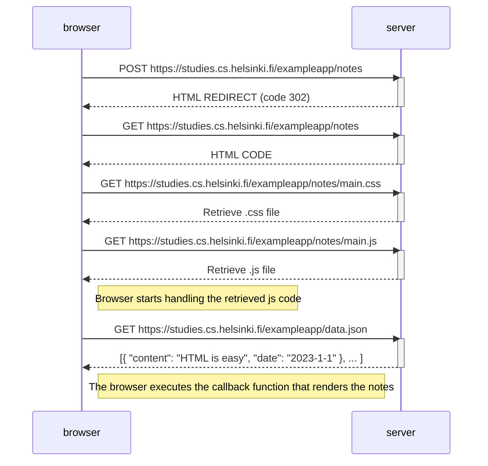

```mermaid
sequenceDiagram
    participant browser
    participant server
    
    browser->>server: POST https://studies.cs.helsinki.fi/exampleapp/notes
    activate server
    server-->>browser: HTML REDIRECT (code 302)
    deactivate server
    
    browser->>server: GET https://studies.cs.helsinki.fi/exampleapp/notes
    activate server
    server-->>browser: HTML CODE
    deactivate server
    
    browser->>server: GET https://studies.cs.helsinki.fi/exampleapp/notes/main.css
    activate server
    server-->>browser: Retrieve .css file
    deactivate server
    
    browser->>server: GET https://studies.cs.helsinki.fi/exampleapp/notes/main.js
    activate server
    server-->>browser: Retrieve .js file
    deactivate server

    Note right of browser: Browser starts handling the retrieved js code

    browser->>server: GET https://studies.cs.helsinki.fi/exampleapp/data.json
    activate server
    server-->>browser: [{ "content": "HTML is easy", "date": "2023-1-1" }, ... ]
    deactivate server    

    Note right of browser: The browser executes the callback function that renders the notes 
```